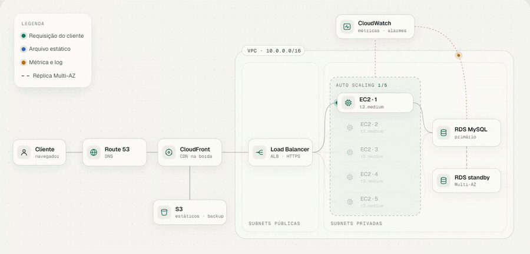
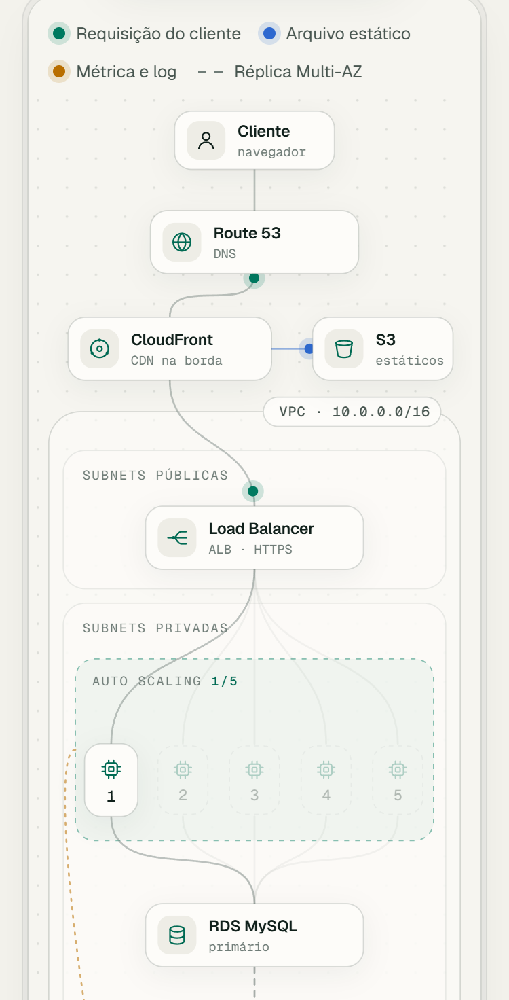

# AWS Pharma Architecture

Arquitetura de referência na AWS para um e-commerce farmacêutico, com documentação interativa: siga uma requisição pelo diagrama, abra cada serviço e simule o tráfego com os custos reais da planilha.

**[Ver ao vivo](https://leandromlmoreira.github.io/aws-pharma-architecture/)**

[](https://leandromlmoreira.github.io/aws-pharma-architecture/)

<p>
  
  
</p>

## Funcionalidades

- **Diagrama animado em SVG próprio.** Pacotes percorrem o caminho da requisição (cliente → Route 53 → CloudFront → Load Balancer → EC2 → RDS), com arquivos estáticos indo ao S3 e métricas subindo ao CloudWatch. Layout horizontal no desktop e vertical no celular; com `prefers-reduced-motion`, os pacotes ficam parados.
- **Painel por serviço.** Clique (ou Enter) em qualquer serviço para ver o papel dele, o custo mensal tirado de `analise-custos.csv` e as decisões de arquitetura, cada uma com o documento de origem.
- **Simulador de tráfego.** Um slider de pedidos por dia escala as instâncias EC2 no diagrama e recalcula o custo mensal. Regra explícita: 1 instância t3.medium a cada 2.000 pedidos/dia; mínimo, máximo e alvo de CPU lidos de `documentacao-tecnica.md` (1 a 5 instâncias, CPU 70%). Cada instância extra soma a linha da EC2 t3.medium e a do EBS; as demais linhas ficam fixas. Acima de 10.000 pedidos/dia o grupo satura e a CPU passa do alarme de 80%.
- **AWS x on-premises.** Gráfico de barras com o custo recorrente anual das duas opções, acompanhando o simulador. Um botão remove o salário do administrador de TI e mostra de onde vem a economia.
- **Custos por linha.** As 15 linhas da planilha ordenadas pelo peso na conta.
- **Tema claro e escuro** (segue o sistema, com alternância manual), navegação por teclado e layout sem rolagem horizontal a partir de 375 px.

## Arquitetura

```
[Cliente] → [Route 53] → [CloudFront] → [Application Load Balancer] → [EC2 em Auto Scaling] → [RDS MySQL Multi-AZ]
                              ↓                                                ↓
                         [S3: estáticos e backup]                  [CloudWatch: métricas, logs e alertas]
```

| Serviço | Papel |
|---|---|
| **Route 53 + CloudFront** | DNS e CDN na camada pública |
| **Application Load Balancer** | HTTPS com certificado do Certificate Manager, health check em `/health` |
| **EC2 (Auto Scaling)** | Aplicação web em t3.medium, de 1 a 5 instâncias com alvo de CPU em 70% |
| **RDS MySQL** | Catálogo, clientes, vendas e medicamentos controlados, em subnets privadas, com backup diário |
| **S3** | Arquivos estáticos e backups |
| **CloudWatch + SES + SNS** | Métricas, logs e alertas por e-mail e SMS |
| **VPC** | `10.0.0.0/16` com subnets públicas e privadas e NAT Gateway |

Detalhes de rede, security groups, backup e disaster recovery estão em [`documentacao-tecnica.md`](documentacao-tecnica.md); o passo a passo de implantação, em [`manual-implementacao-aws.md`](manual-implementacao-aws.md).

## Custos

[`analise-custos.csv`](analise-custos.csv) soma US$ 308,30 por mês (US$ 3.699,60 por ano). O front importa o CSV no build e recalcula tudo a partir das linhas. Na comparação com on-premises, a página usa o custo recorrente anual das linhas da planilha (manutenção, energia e administrador de TI: US$ 63.200) e deixa a compra do servidor (US$ 5.000, única) fora da barra. O resultado é uma economia de cerca de 94% ao ano, quase toda vinda do salário do administrador.

## Stack

- **Infraestrutura:** AWS (EC2, RDS MySQL, CloudWatch, VPC, S3, CloudFront, Route 53, ALB, Certificate Manager, SES, SNS)
- **Front:** Vite + TypeScript sem framework, SVG e CSS próprios, fontes Bricolage Grotesque, Geist e Geist Mono
- **Deploy:** GitHub Pages via GitHub Actions ([`deploy-pages.yml`](.github/workflows/deploy-pages.yml))

## Como rodar

```bash
cd web
npm install
npm run dev
```

`npm run build` gera `web/dist`. O deploy roda a cada push na `main` que altere `web/`, a planilha ou a documentação técnica.

---

<sub>Base: desafio de infraestrutura da trilha AWS da DIO.</sub>
