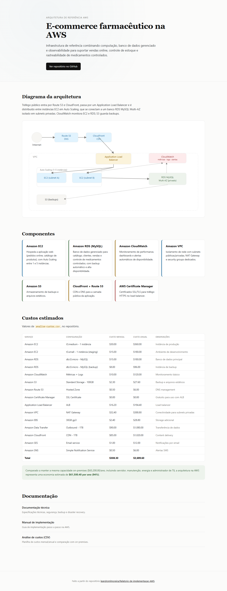

# Arquitetura de referência para e-commerce farmacêutico na AWS

**[Ver ao vivo](https://leandromlmoreira.github.io/Relatorio-de-implementacao-AWS/)**

[](https://leandromlmoreira.github.io/Relatorio-de-implementacao-AWS/)

Infraestrutura de referência para uma plataforma de e-commerce do setor farmacêutico, demonstrando como combinar computação, banco de dados gerenciado e observabilidade na AWS para suportar vendas online, controle de estoque e rastreabilidade de medicamentos controlados.

O cenário usado é o de uma farmácia fictícia (Abstergo Industries), mas a arquitetura e as práticas aplicadas servem como ponto de partida para qualquer aplicação web que precise de alta disponibilidade, backup automatizado e monitoramento em produção.

## Arquitetura

```
[Internet] → [Application Load Balancer] → [EC2 (Auto Scaling)] → [RDS MySQL Multi-AZ]
                                                    ↓
                                          [CloudWatch: métricas, logs e alertas]
```

- Tráfego público entra por um Application Load Balancer, que distribui requisições entre instâncias EC2 em Auto Scaling.
- As instâncias EC2 rodam a aplicação web e se conectam a um banco RDS MySQL isolado em subnets privadas.
- CloudWatch coleta métricas de CPU, memória, disco e conexões de banco, disparando alertas por e-mail/SMS quando limites são excedidos.

Detalhes de rede, security groups, backup e disaster recovery estão em [`documentacao-tecnica.md`](documentacao-tecnica.md).

## Componentes da arquitetura

| Serviço | Papel na arquitetura |
|---|---|
| **Amazon EC2** | Hospeda a aplicação web (pedidos online, catálogo de produtos), com Auto Scaling entre 1 e 5 instâncias |
| **Amazon RDS (MySQL)** | Banco de dados gerenciado para catálogo, clientes, vendas e controle de medicamentos controlados, com backup automático e alta disponibilidade |
| **Amazon CloudWatch** | Monitoramento de performance, dashboards e alertas automáticos de disponibilidade |
| **Amazon VPC** | Isolamento de rede com subnets públicas/privadas, NAT Gateway e security groups dedicados |
| **Amazon S3** | Armazenamento de backups e arquivos estáticos |
| **Amazon CloudFront + Route 53** | CDN e DNS para a camada pública da aplicação |
| **AWS Certificate Manager** | Certificados SSL/TLS para tráfego HTTPS no load balancer |

## Exemplo: provisionamento da instância de aplicação

```bash
# Tipo de instância: t3.medium (2 vCPUs, 4 GB RAM), Ubuntu Server 20.04 LTS, 30 GB gp3
sudo apt update
sudo apt install nginx mysql-client php-fpm php-mysql
```

Resultado esperado: instância pronta para servir a aplicação via Nginx, com cliente MySQL configurado para se conectar ao RDS pela subnet privada.

O passo a passo completo (EC2, RDS, CloudWatch, rotinas de manutenção e troubleshooting) está em [`manual-implementacao-aws.md`](manual-implementacao-aws.md).

## Custos e comparação com on-premises

A planilha [`analise-custos.csv`](analise-custos.csv) detalha o custo mensal/anual estimado de cada serviço (~US$ 300/mês) e compara com o custo de manter a mesma capacidade em infraestrutura própria, projetando uma economia anual da ordem de 94%.

## Stack

AWS: EC2, RDS (MySQL), CloudWatch, VPC, S3, CloudFront, Route 53, ALB, Certificate Manager, SES, SNS.

## Como reproduzir

1. Siga [`manual-implementacao-aws.md`](manual-implementacao-aws.md) para provisionar VPC, EC2 e RDS na ordem descrita.
2. Configure os security groups e o Application Load Balancer conforme [`documentacao-tecnica.md`](documentacao-tecnica.md).
3. Ative métricas e alertas no CloudWatch e valide os limites de escala automática.

## Front-end de documentação

A pasta `web/` traz uma página estática de uma tela só (Vite + TypeScript) reunindo o diagrama da arquitetura em SVG, um card por componente AWS, a tabela de custos lida diretamente de `analise-custos.csv` com o total mensal/anual, e links para os três documentos do repositório.

```
cd web
npm install
npm run dev
```

O deploy é automático via GitHub Actions para o GitHub Pages a cada push em `web/` na branch `main`.

## Documentação

- [`documentacao-tecnica.md`](documentacao-tecnica.md) — especificações técnicas, segurança, backup e disaster recovery
- [`manual-implementacao-aws.md`](manual-implementacao-aws.md) — guia de implementação passo a passo
- [`analise-custos.csv`](analise-custos.csv) — planilha de custos e comparação com on-premises

---

Base: desafio de infraestrutura da trilha AWS da DIO.
